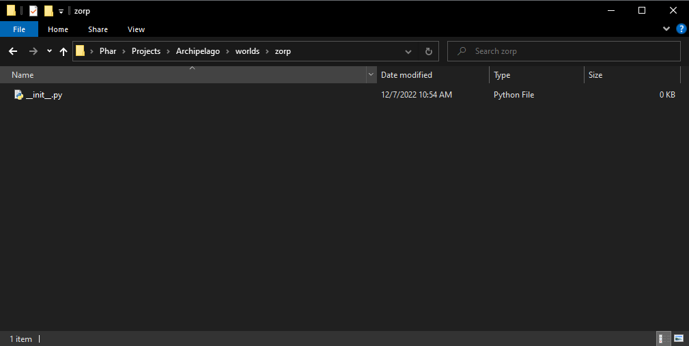

# The Holy Guide to Archipelago Game Integration

This guide walks through the process for developing a new game into Archipelago ecosystem.

There are two key requirements to successfully incorporate a game:

- A **world definition** that sets up all the locations, regions, items, rules, etc. to generate a seed.
- A **game client** capable of communicating with the Archipelago MultiServer.

A intermediate level of Python experience is required for writing the world definition, but game clients can be in any language as long as they can communicate with the server via the [AP Network Protocol](https://github.com/ArchipelagoMW/Archipelago/blob/main/docs/network%20protocol.md).

## World Definition

Creating a randomizer for Archipelago involves several steps that may need to be done, but the most important step is creating the world definition that holds all the logic and information about your game.

All games, thereafter called "worlds", exist in the `worlds` folder (who would have guessed?), and the Archipelago Generator and MultiServer reads from this directory to find game implementations.

A typical world definition will include the following information:

- Basic meta data about the game.
- A table of possible items.
- A table of possible locations.
- A table of possible randomizer options.
- Rules for determining when locations are "accessible".
- The underlying logic for how to generate a world.

To follow python conventions, your world folder should be formatted like so: `game_name`. Inside your `game_name` folder, you can have as many python files as you need to structure your game, but you will be required to include a `__init__.py` file to host your main game class so Archipelago knows where to pull your world data from.

Let's create an example game, called "Zorp". Create a folder named `zorp` in the `worlds` directory, then create a new `__init__.py` file in that folder.



The `AutoWorld.py` file in the `worlds` folder contains the base class `World` we will need to derive from to hold our logic and definitions. Inside `__init__.py`, let's import `World` and add the following code to start:

```py
from ..AutoWorld import World


class ZorpWorld(World):
    """Zorp is the story of a boy on a mission to find his lost action figure, "Commander Zorp"."""

    game = "Zorp"             # The human-readable name of our game.
    item_id_to_name = {}      # A lookup table for item ids to names.
    location_id_to_name = {}  # A lookup table for location ids to names.

    # Create and return and Item for this world.
    def create_item(self, name: str):
        # TODO: Write this function!
        pass
```

Let's break this down.

1. The docstring in our `ZorpWorld` is a brief human readable description of what our game is about.
    - This is used on the website's game page.
2. The `game` attribute is our human readable game name.
3. The `item_id_to_name` and `location_id_to_name` attributes describe `Dict[int, str]` lookup tables to find an item or location name by its ID. We haven't created any items or locations yet, so we'll leave them empty for now.
4. The `create_item(self, name: str)` method is an abstract method on our `World` base class that needs to be defined in our definition. We'll need to add logic for looking up an item, creating the item, and returning the newly created item once we get to adding items. For now, we'll just `pass`.

The `World` base class also defines a number of additional attributes and methods you can override (along with comments) to help build your world definition. Most of these methods are called by the Generator in stages of the generation process, so certain assumptions can be made when defining your generation logic.

As of the time of this writing, after instantiating each world, the Generator runs through these stages and calls their corresponding method.

0. `assert_generate` - Each world asserts it can generate safely. This is useful for games that need a base rom to create a patch file successfully, so if the base rom isn't present, it will fail this process before our time is wasted trying to generate something .
1. `generate_early` - This stage is used if anything needs to be done before regions, items, locations, rules are created and set. After this stage, any items that defined in `start_inventory` in a player's settings.yaml are  "pre-collected".
2. `create_regions` - All the regions (collections of locations) are created, connected together, and locations are created and assigned to them. Then these regions are added to the `MultiWorld`.
3. `create_items` - This stage is designed to create the necessary items for this world. Then these items are added to the `MultiWorld`.
4. `set_rules` - At this point, all the regions and locations are created and we can set the access rules for any `Region`, `Location`, or `Entrance` based on world settings or generation. This allows us to set up the logic so, for example, Location A needs Item B and Item C to be accessible.
5. `generate_basic` - Any other tasks that need to be done before the fill process is started. After this stage, if there are any item links, those are linked and any plando or early items are placed in locations.
6. `pre_fill` - After plando and item links are processed, if there are any steps that need to be done to fill locations with random items, following access rules, before the main fill algorithm takes over, they need to be done in this step.
7. **The main fill algorithm runs and fills any remaining empty locations, ensuring that games are still beatable.**
8. `post_fill` - If anything needs to be done after the main fill, it can be done here.
9. `generate_output` - If your world needs to generate an output file (e.g. patch files for roms). It is done here. At this point the `MultiWorld` is completely done generating. After all these are complete, and the generator outputs the multidata file and spoiler (if enabled). If additional information needs to be written to the spoiler, you can use the `write_spoiler_header`, `write_spoiler`, and `write_spoiler_end` methods.

We're not going to use all these methods in this example, but we will use a few and knowing the order they are called will help us make assumptions on when to do certain tasks.
